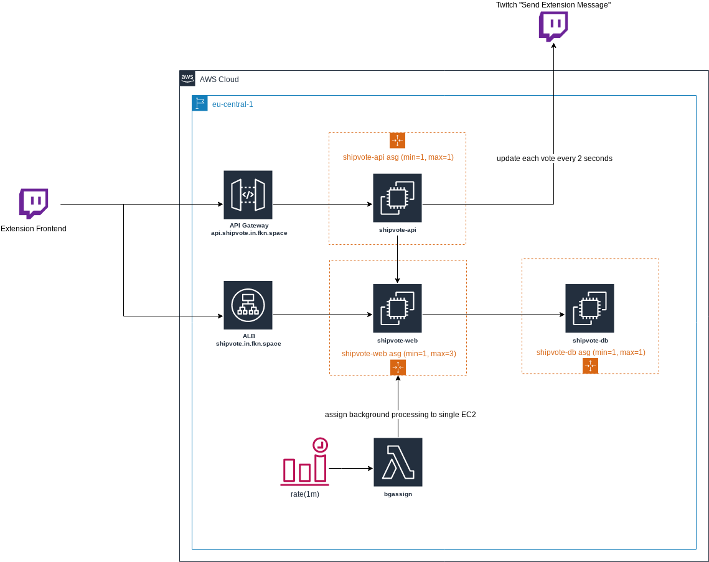

# Shipvote

Shipvote is a Twitch Extension for the Game "World of Warships" allowing streamers to let their viewers
vote for a ship they should play on stream. It provides a lot of customization options for streamers.
For a user manual, please head over to [the user documentation](https://shipvote.in.fkn.space/getting-started).
This README serves as a technical overview.

## Architecture

### Application Monitoring

The monitoring for this application is sponsored by [AppSignal](https://appsignal.com). Feel free
to give it a try, it's been really helpful for performance insights and finding slow code paths.

### Architecture Overview

### `shipvote-web`

`shipvote-web` is the main Elixir(+Phoenix) application containing all logic for
handling the votes. It verifies the JWT received from twitch and also accesses the
Wargaming APIs.

### `shipvote-api`

The `shipvote-api` is a thin layer accepting a few calls relevant to send live-updates
via the Twitch "Send Extension Message" API. This allows high-frequency updates without
incurring extra costs for calls and data transfer on my own infrastructure. You can read
more about why this component exists below.
The `shipvote-api` application is written in go and acts as a proxy to the `shipvote-web`.
It accepts calls to open a vote, close a vote, and vote for a ship. This allows it to handle
the lifecycle of a vote and send updates.

### Design Decisions

#### Learnings from 1.x infrastructure

You can read more about the version 1.x infrastructure [here](docs/1.x/README.md).
The main issue with the 1.x infrastructure was becoming the non-existent automated
scalability for droplets on DigitalOcean. This is why I decided to migrate the project
to AWS, using the Database Migration Service from AWS and using `packer` to automate
AMI creation.

#### Learnings from early AWS infrastructure

The early infrastructure only included the Application Load Balancer. Due to the volume
of calls received by the backend, it was quickly becoming obvious that the costs of
operating the application would become too high. After researching more on the Twitch APIs,
I found out that you can use a Messaging system on Twitch to send live-updates. This is how
the `shipvote-api` package came to existence.

### API Flows

This section describes interactions with the `backend` and third party APIs.

#### Channel Configuration

#### Twitch Video Overlay

