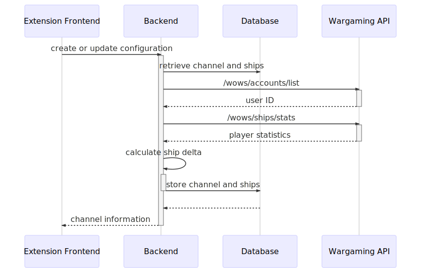
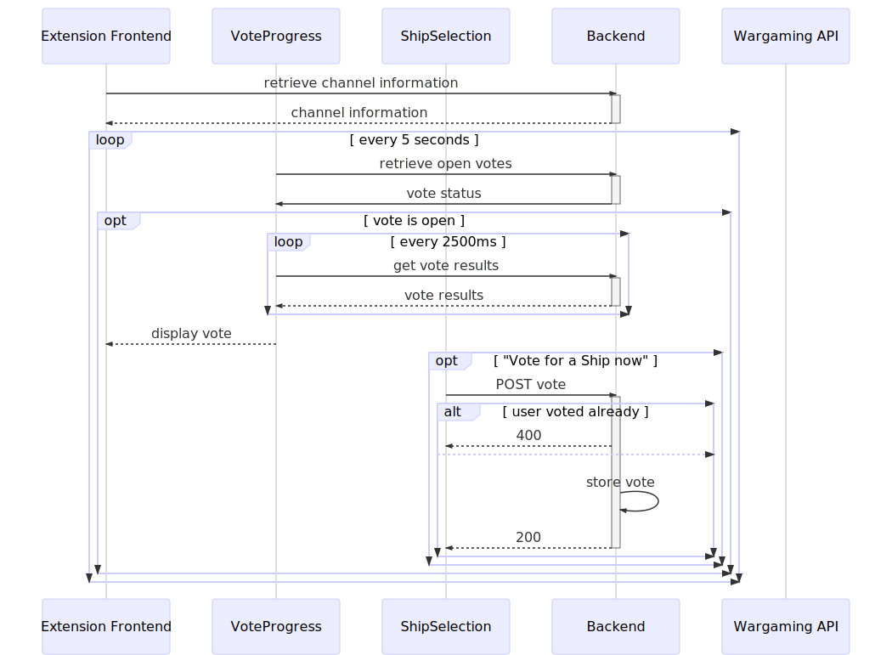

<!--# Shipvote-->

<!--TODO: Description-->

<!--## Backend Architecture-->

<!---->

### API Flows

This section describes interactions with the `backend` and Wargaming APIs.

#### Channel Configuration

#### Twitch Video Overlay

